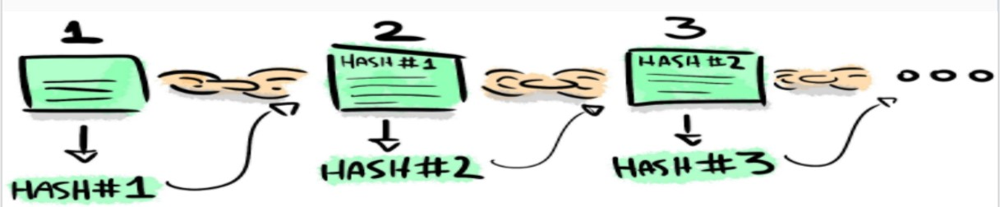

# Building Blockchain using Google Spreadsheets

The best way to learn Blockchain is to build one and play with it:
Source: https://stackoverflow.com/questions/7994410/hash-of-a-cell-text-in-google-spreadsheet

In the excel click on any of the cell, provide the data in that cell, move to the next cell and use the commands below:
•	MD5(provide cell number)
•	SHA256(provide Cell number)

•	If Blockchain contain bricks, hashing is the mortar — the magic sauce that holds everything together.
•	changing a single character anywhere will result in a completely arbitrary new hash
•	A Blockchain is a ledger of transactions. These transactions are grouped into Blocks and incrementally added to the chain as time goes on.
•	Each block references previous block like a linked list. The first block is called Genesis block.
•	The hash gives the block fraud protection- if a malicious actor had to modify any filed within the block, the whole network would know because the hash would have changed.

# Mining: 
•	If you studied the valid block carefully you’d notice something strange about the hash: it starts with six zeros! Which is weird because the first thing we learnt was that hashes are random. So what’s the probability of hashing something that starts with 6 zeros? About 1 in 2²⁴ = 16,777,216 or extremely unlikely.
•	This is the rule for determining if blocks are valid—if they start with a certain number of zeros (I chose 6 for this example).
•	To drive this concept home, try getting the block’s hash to begin with a single 0. It should take you on average 16 attempts.

# The job of a miner:
•	A miner is someone on the network interested in creating new bitcoins by forming a new block.
•	This is where the Junk field comes in. A miner sets a random Junk value, hashes the block and checks if it begins with zeros. If it doesn’t, they insert another Junk value and try again, and again, until they’re successful.
•	💡 Heard of mining hardware? This is what mining hardware does. Because it’s specialized, it can perform the hashing faster than a regular computer.
•	As a reward for doing this work the miner receives some bitcoin as the first transaction in a block. This reward is how new bitcoins are created and it decreases over time.
•	💡 The reward halves every 210,000 blocks. At time of writing it is 12.5 bitcoins but will halve to 6.25 bitcoins in 2020, and eventually become zero in 2140. This is how the Bitcoin supply is controlled—there will only ever be 21 million bitcoin. Here’s the Bitcoin wiki describing the supply.
•	The number of zeros the hash begins with is called the difficulty and it changes frequently because computers get faster each year. Bitcoin aims to create a new block roughly every 10 minutes, after every 2016 blocks the difficulty is re-evaluated.

# Proof of Work:
•	The algorithm described above—the act of setting a junk value and determining if the block hash begins with zeros is called Proof of Work: the junk value is the proof that the miner did the work!
•	Given a block, it’s trivial for anyone on the network to compute the hash and verify that it begins with zeros. The genius here is that Proof of Work is something that is extremely difficult to compute but easy to verify.
•	Once a miner has found a valid junk value they broadcast the block, causing everyone to check the block does indeed begin with the required number of zeroes. If everyone adds the block to their Blockchain. We say that the network has now reached consensus on the new block

# The immutability of Blockchain:
•	When a block is hashed, it contains the previous block’s hash in the Previous Hash field. This is why it’s called a “chain”. This may seem superficial but it’s what gives the blockchain immutability—a single change anywhere invalidates the hashes of all the subsequent blocks

# Concepts not covered?
•	Transactions—they’re digitally signed by the person that created them. Understanding this process involves a fair amount of cryptography knowledge.
•	Wallets—software that keeps track of transactions sent to your public key (think address). Most wallets are Bitcoin nodes themselves.

# MD5 in python-gives same output:

# Blockchain VSs traditional Databases
No one in the Blockchain has more decision making power than anyone else
•	Traditional databases use client-server network architecture. Client can login, authenticate himself and modify data, which is stored on a centralized server. Blockchain databases consist of several decentralized nodes. Each node participates in administration: all nodes verify new additions to the Blockchain, and are capable of entering new data into the database. For an addition to be made to the Blockchain, the majority of nodes must reach a consensus ( a general agreement).
•	In a traditional database, a client can perform four functions on data: Create, Read, Update and Delete (CRUD operations). The Blockchain is designed to be an append-only structure. A user can only add more data, in the form of additional blocks (after validation of a transaction, and writing of a new transaction). All previous data is permanently stored and cannot be altered.
•	In a traditional database, anybody with sufficient access to a centralized database can destroy or corrupt the data within it, but Blockchain technology uses decentralized data storage to side step this issue, thereby building security into its very structure.
•	Traditional databases are better suited for all kinds of information, whereas Blockchain technology is well suited to record certain kinds of peer-peer transactions

# What kind of databases are used by Blockchain platforms? Protocols: https://medium.com/edchain/a-comparison-between-5-major-blockchain-protocols-b8a6a46f8b1f

# Use cases:
### Student Marks Sheet verification:

# Attendance sheet management:

# References:
1.	https://www.includehelp.com/data-structure-tutorial/hashing.aspx
2.	https://www.gradelink.com/wp-content/uploads/2019/03/DigitalAttendance.jpg
3.	https://medium.com/swlh/what-blockchain-needs-is-selflessness-5286501c9d4a
4.	https://medium.com/swlh/what-blockchain-needs-is-selflessness-5286501c9d4a
5.	https://medium.com/@BangBitTech/what-is-consensus-algorithm-in-blockchain-different-types-of-consensus-models-12cce443fc77
6.	https://stackoverflow.com/questions/7994410/hash-of-a-cell-text-in-google-spreadsheet
7.	https://medium.com/edchain/a-comparison-between-5-major-blockchain-protocols-b8a6a46f8b1f
8.	https://medium.com/@vanflymen/learn-blockchains-by-building-one-117428612f46
9.	https://medium.com/@vanflymen/learn-blockchains-using-spreadsheets-b97ad92b9b4d
10.	https://mayur-patil.blogspot.com/2021/04/invited-online-fdp-cyber-security-with.html

