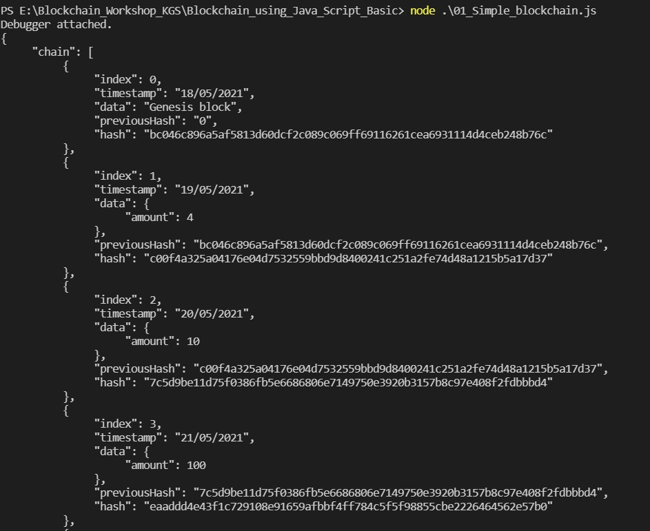
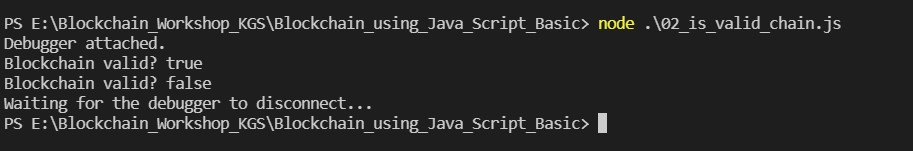
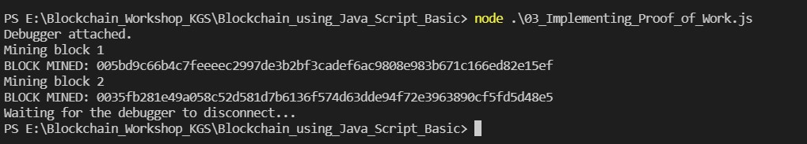
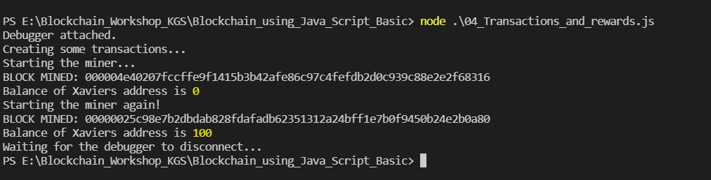
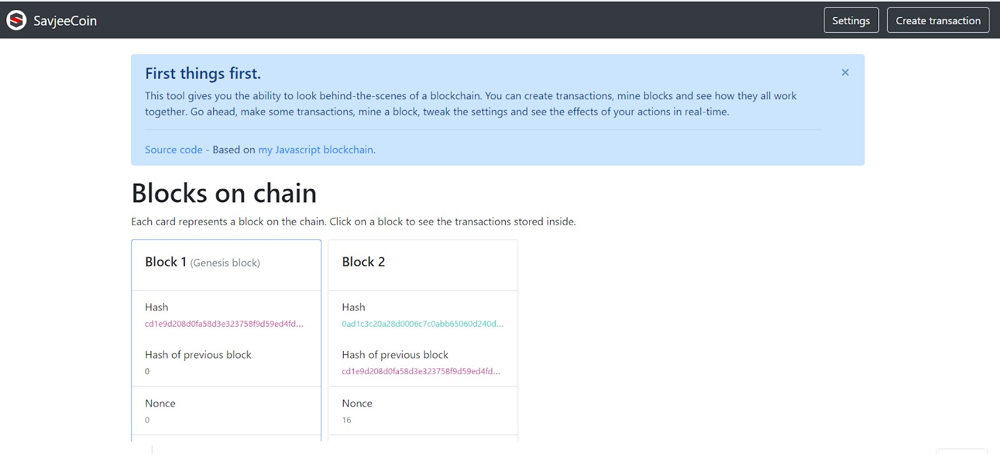
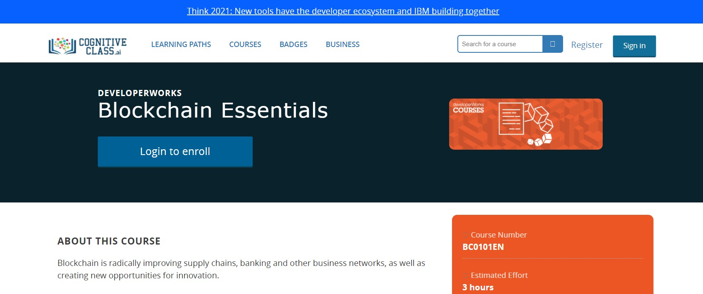

# Blockchain using JavaScript	
## A no-code, no-hype Blockchain -Demo: https://tools.superdatascience.com/blockchain/block
Iterate through all the tabs.

## Signatures and Private Key: https://tools.superdatascience.com/blockchain/public-private-keys/keys

# Installation and setup Node.js:
Install these tools specific to the operating system of your choice.
1.	Install node.js: https://nodejs.org/en/
2.	Install crypto-js using the command: once node.js is installed, from the command line run the below given command: **npm crypto-js**
3.	Install visual studio (recommended): or any other command line terminals are fine.

# Blockchain using JavaScript-For Education Purpose only:
•	Simple Implementation
•	Is a Valid Chain
•	Adding Proof of work
•	Mining rewards and transactions

# 01_Simple_Blockchain.js
### Output

# 02_is_Chian_valid.js:
### Output

# 03_Implementing_Proof_of_work.js
### Output

# 04_transaction_and_rewards.js

# Validity of Blockchain:
•	Block chains are great because, once a block is added, it cannot be changed without invalidating the other blocks of the chain as the integrity gets lost
•	We could loop it the end of chain and verify if the all block is connected and hence valid.
•	If any data is tampered, Blockchain gets invalid. So we cannot delete or change any internal blocks in chain. We could write a logic to rollback and restore a block to correct state.
•	Transactions are digitally signed using private key of the person that created them
•	Wallets-Software that keeps track of transactions sent to your public key (think as address)

Behind the scenes of Blockchain-Demo: https://savjee.github.io/savjeecoin-frontend/

# Smart Contracts- Car auction: https://developer.ibm.com/technologies/blockchain/patterns/car-auction-network-hyperledger-fabric-node-sdk-starter-plan/
1. Blockchain technology is essentially an accounting system that is operated by a network that follows a set of rules laid out by code- src
2. Smart contracts are integral part of Blockchain technologies
3. Smart contracts are code executed on the Blockchain network
4. Often, they define the rules of a business contract and are executed programmatically when preconditions for the contract are met.

# Proof of Work (POW)-Safety of Blockchain-The junk value is the proof that the miner did the work
1. We don’t want people to spam our Blockchain by creating lots of unnecessary blocks
2. So, there is a rule-made-to put a lot of computing power in making a new block-we call this as mining! So, here miner is going to prove that, he has put lots of work in mining to create a new block.
3. A miner (wrt BitCoin) is someone on the network interested in creating new bitcoins by forming a new block. Mining in Blockchain=solving complex hashing puzzles!
4. Bitcoins rule is that clients accept the chain with the most amount of work (think of those zeros0 which is usually the longest chain they can see.
5. Security Issue: If we change the data of any block and recalculate hash for all the blocks, then the entire Blockchain remains valid.

# Bitcoin and Mining Rewards-Miners race to solve puzzle, in order to create a new block
1. Virtual crypto currency gets introduced in the system
2. Rewards for miners- Anyone with the computer and internet could validate the transactions (and they are rewarded). So here there is no fixed trusted 3rd party like bank to validate your transactions. So, here miner is someone on the network interested in creating bit coins by forming a new block
3. Global currency, valid across borders
4. Anyone can verify any transaction that has ever taken place
5. Mine a new block for all pending transactions. There is 10 minutes gap introduced (Proof of Work Algorithm) between creation of 2 blocks due to difficulty level. All the transactions made during this gap are stored as pending transactions, will be included in the next block. On successfully mining a new block, miner gets the reward.  Miners could choose/pick which transaction they would like to include in a block 9max 1 MB).
6. If we try to fool, by doing wrong transactions, trying to increase the reward, network peers will ignore such blocks.

# Applications of Blockchain: 
1. PARAM-A permissioned Blockchain: https://inc42.com/startups/how-cleartax-is-going-beyond-income-tax-with-innovation-for-gst-ai-aided-investments/
2. Top Countries that conducted elections on Blockchain: https://www.blockchain-council.org/blockchain/top-countries-that-conducted-elections-on-the-blockchain/
3. German Frankfurt School to Issue Blockchain-Based Course Certificates: https://cointelegraph.com/news/german-frankfurt-school-to-issue-blockchain-based-course-certificates
4. Blockchain policy by Government-including NITI Aayog of India: https://economictimes.indiatimes.com/technology/policy-muddle-ruins-year-2019-for-crypto-blockchain-industry/articleshow/72432062.cms
5. 30+ Real Examples Of Blockchain Technology In Practice: https://www.forbes.com/sites/bernardmarr/2018/05/14/30-real-examples-of-blockchain-technology-in-practice/?sh=650c568e740d

# Blockchain Essentials Free course- By IBM:
https://cognitiveclass.ai/courses/blockchain-course?course=begin#10954

# References:	
1. https://tools.superdatascience.com/blockchain/hash/
2. https://tools.superdatascience.com/blockchain/public-private-keys/keys
3. https://www.youtube.com/watch?v=X-FPCwZFU_8
4. https://nodejs.org/en/	
5. https://www.youtube.com/watch?v=FBo5Cso-ufE
6. https://savjee.github.io/savjeecoin-frontend/
7. https://developer.ibm.com/technologies/blockchain/patterns/car-auction-network-hyperledger-fabric-node-sdk-starter-plan/
8. https://inc42.com/startups/how-cleartax-is-going-beyond-income-tax-with-https://niti.gov.in/
9. https://www.forbes.com/sites/bernardmarr/2018/05/14/30-real-examples-of-blockchain-technology-in-practice/?sh=650c568e740d
10. https://cognitiveclass.ai/courses/blockchain-course?course=begin#10954
11. https://savjee.be/2017/07/Writing-tiny-blockchain-in-JavaScript/
12. https://mayur-patil.blogspot.com/2021/04/invited-online-fdp-cyber-security-with.html
13. innovation-for-gst-ai-aided-investments/
14. https://www.blockchain-council.org/blockchain/top-countries-that-conducted-elections-on-the-blockchain/
15. https://cointelegraph.com/news/german-frankfurt-school-to-issue-blockchain-based-course-certificates

