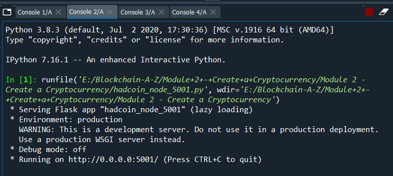

# Build Your Own Blockchain Using Python Programming Language
# Installation files:
1. Download Anaconda python distribution: https://www.anaconda.com/products/individual
2. Install Flask: pip install Flask==0.12.2, using anaconda prompt in windows.
3. Install Postman: https://www.postman.com/downloads/

#Anaconda Python Distribution:
Anaconda is a distribution of the Python and R programming languages for scientific computing (data science, machine learning applications, large-scale data processing, predictive analytics, etc.), that aims to simplify package management and deployment. The distribution includes data-science packages suitable for Windows, Linux, and macOS.

#Spyder IDE:

#Flask:
Flask is a micro web framework written in Python. It is classified as a microframework because it does not require particular tools or libraries. It has no database abstraction layer, form validation, or any other components where pre-existing third-party libraries provide common functions. However, Flask supports extensions that can add application features as if they were implemented in Flask itself. Extensions exist for object-relational mappers, form validation, upload handling, various open authentication technologies and several common framework related tools.

#Postman:
Postman is free to download and use for teams of any size. Wide support for all APIs and Schemas. Make any kind of API call—REST, SOAP, or plain HTTP—and easily inspect even the largest responses. Postman also has built—in support for popular data formats such as OpenAPI GraphQL, and RAML. It's Extensible. Customize Postman for your needs with the Postman API.

#Creating General Blockchain: blockchain.py
#Output

#Decentralize Blockchain on several computers or servers:hadcoin_node_5001.py, hadcoin_node_5002.py, hadcoin_node_5003.py, nodes.json, transaction.json
(here we are running on local host with three different terminals and port numbers) to create a crypto currency

Open three consoles and run separate files on 5001, 5002 and 5003 ports respectively:

•	Open three consoles and run separate files of hadcoin_node_5001 & 5002 & 5003 respectively.

•	Open the postman and create three more tabs
1. http://127.0.0.1:5001/get_chain
2. http://127.0.0.1:5001/mine_block
3. http://127.0.0.1:5002/get_chain
4. http://127.0.0.1:5002/mine_block
5. http://127.0.0.1:5003/get_chain
6. http://127.0.0.1:5003/mine_block

•	Make POST Requests to connect the nodes to each other
For Node 5001:
1. Select POST on each node
2. Copy the code from nodes.json file.
3. Make the request to node 5001 as : http://127.0.0.1:5001/connect_node
4. Select Body→ raw→ json. Then paste the json code, remove the first line of the code, as the node itself is 5001.
5. Then click Enter or Send.
6. Repeat the same steps for Node 5002 and 5003.

•	Now we test the consensus, what happens if on one node we get a chain that is larger than the chains on the other node
1. Change request to GET on all the nodes and mine a block on node 5001.
2. Use http://127.0.0.1:5001/mine_block 
3. and then use  http://127.0.0.1:5001/get_chain
4. Check the number of blocks on node 5002 and 5003. 
http://127.0.0.1:5002/get_chain
http://127.0.0.1:5003/get_chain
5. Use replace_chain on nodes 5002 and 5003, so that number of blocks matches on node 5001 matches with nodes 5002 and 5003.
http://127.0.0.1:5003/replace_chain
6. Check with the blocks of all the nodes, they have to be same, just check with the timestamps when a genesis block of node 5001 is created, which should match with all the blocks.
7. Change the request to POST on node 5001 and add_transaction, copy the json code from add_transaction.
http://127.0.0.1:5001/add_transaction
{
    "sender": "Hadelin",
    "receiver": "Kirill",
    "amount": 10000
}
8. Give enter, then change the request to GET and mine_block , so that transaction will be added to the blockchain.
http://127.0.0.1:5001/mine_block

•	Check the number of blocks on node 5002 and 5003. 
1. http://127.0.0.1:5002/get_chain
2. http://127.0.0.1:5003/get_chain

•	Use replace_chain on nodes 5002 and 5003, so that number of blocks matches on node 5001 matches with nodes 5002 and 5003.
http://127.0.0.1:5003/replace_chain

•	Change the request to POST on node 5001 and add_transaction, copy the json code from add_transaction.
http://127.0.0.1:5001/add_transaction
{
    "sender": "Hadelin",
    "receiver": "You",
    "amount": 100000
}
 Give enter, then change the request to GET and mine_block , so that transaction will be added to the blockchain.
http://127.0.0.1:5001/mine_block

Now, all the blocks in the chain have to match with the blocks of node 5001,5002 and 5003.

#References:
1. https://www.anaconda.com/
2. https://upload.wikimedia.org/wikipedia/commons/f/f4/Anaconda.Starting_page.png
3. https://www.spyder-ide.org/
4. https://upload.wikimedia.org/wikipedia/commons/thumb/3/3c/Flask_logo.svg/1200px-Flask_logo.svg.png

