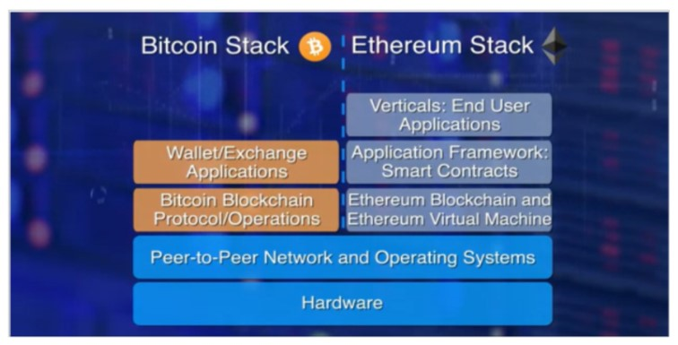
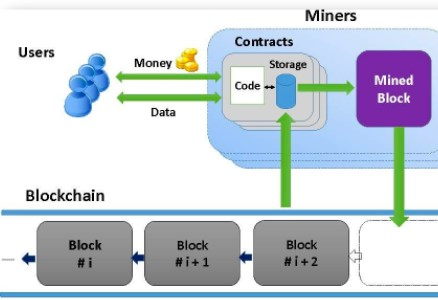
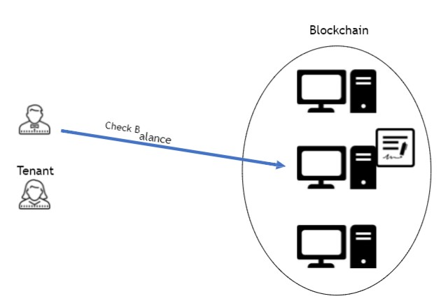
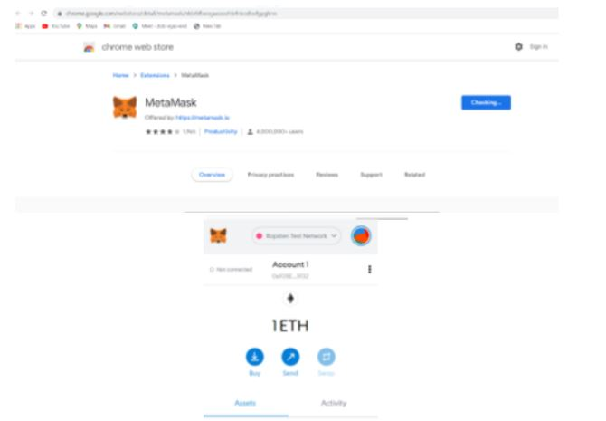
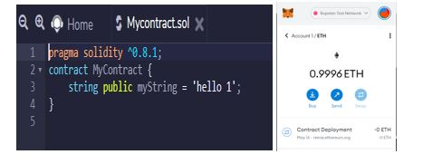
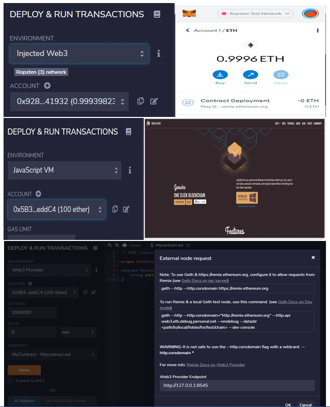

# Basics of Solidity Programming for Developing Smart Contracts

# Smart Contracts:
•	Computer algorithms can be written to automatically execute the terms of a contract.For example, Company X pay $1,000 to Company Y when shipping 	company provides proof of delivery of Package A to Company X
•	Blockchain distributed ledgers can be used to not only store the proof of delivery record, but instructions on what to do (terms of the contract) and scripts to execute the instructions (supply chain example)
•	Alternatively, solar power systems on buildings belonging to different owners can be set to negotiate the transfer of power from one to the other when one needs power and the other has excess available.

# Ethereum Blockchain:

# What is Ethereum?
•	The official website’s definition of Ethereum is as follows: https://ethereum.org/en/
•	“Ethereum is a global, open-source platform for decentralized applications. On Ethereum, you can write code that controls digital value, runs exactly as programmed, and is accessible anywhere in the world”.
•	The Blockchain technology (in general) and mainly the Ethereum exist to remedy this.
•	Ethereum’s vision is to build a ‘new internet.’ One that would be decentralized as it was always meant to be. An internet where,
•	Peer-to-peer networks would replace the client-server model.
•	Any data would be owned only by its creator.
•	There would be no monopoly of data.
•	Applications won’t steal data in the name of ‘tailor-made’ services.
•	The National Institute of Standards and Technology (NIST) of the United States of America defines smart contracts as –
•	“A collection of code and data (sometimes referred to as functions and state) that is deployed using cryptographically signed transactions on the blockchain network.”
•	Smart contracts utilize mathematical algorithms, hence they eliminate the requirement of middle-men to uphold their sanctity and ensure enforcement.

# Smart Contracts:
•	In the form of  code
•	Stored on a  Blockchain
•	Executes under given conditions

Owner creates the contract
Contract replicates among all the nodes Owner
Tenant deposits to the contract
Contract’s State changes on all the nodes Owner
Owner checks the contract’s balance
Contract’s state is fetched from one node Owner

# Steps in developing a Smart Contract:
1.	Developing a simple contract
2.	Compiling the contract
3.	Deploying the contract
4.	Interacting with the contract
5.	Adding more functions to our code to make it more practical

# Solidity programming:
•	Object-oriented
•	Contract-oriented
•	High-level language
•	Influenced by C++, Python, and JavaScript
•	Target Ethereum Virtual Machine (EVM)
•	Serpent as an  Alternative?
o	Low-level language
o	Complex compiler

# Create your First Transaction:
Steps to be followed:
1. Download, Install and Use a Wallet to Create a Transaction
2. Installing Metamask: https://chrome.google.com/webstore/detail/metamask/nkbihfbeogaeaoehlefnkodbefgpgknn
3. Setup Metamask
4. Get Free Ether
5. Track funds: Go to https://etherscan.io/ 

# Lab: Use Remix IDE to Write your first Smart Contract
Steps to be followed:
1. Setup Remix: http://remix.ethereum.org
2. irst Smart Contract
3. Deploy Smart Contract
4. Smart Contract Interaction

# Lab: Use different Blockchain Networks
Steps to be followed:
1. Smart Contract
2. Injected Web3
3. JavaScript VM
4. Web3 Provider

# References:
1. https://ethereum.org/en/
2. K. Delmolino, M. Arnett, A. E. Kosba, A. Miller, and E. Shi, “Step by Step Towards Creating a Safe Smart Contract:  Lessons and Insights from a Cryptocurrency Lab,” IACR Cryptology ePrint Archive, vol. 2015, p. 460, 2015.

