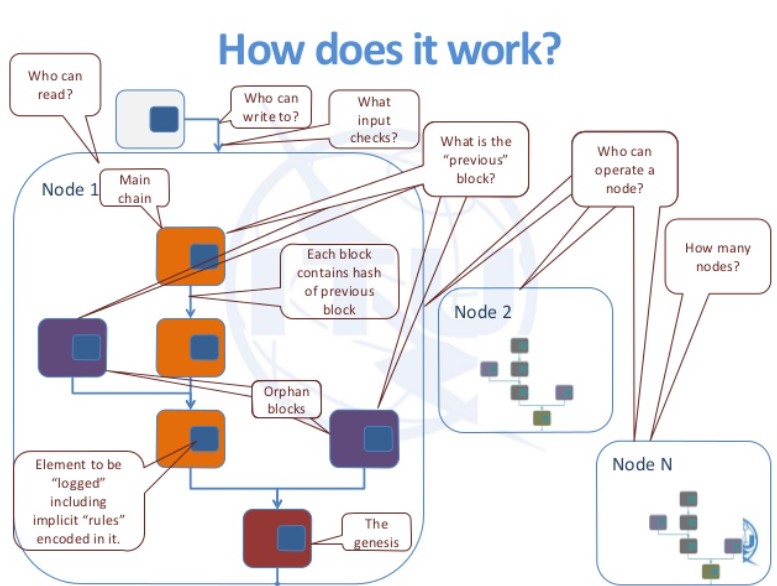
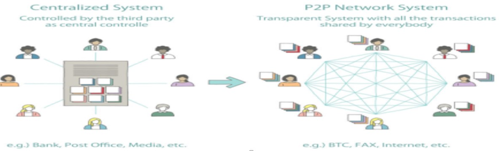
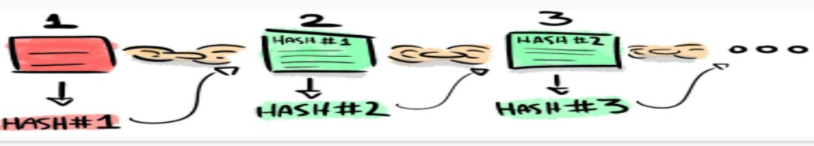
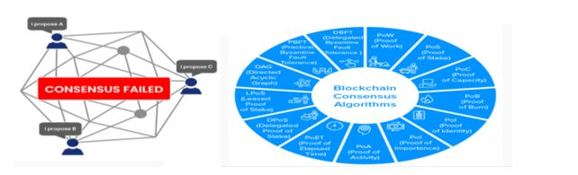

# Practical_approach_for_Building_Blockchain

The course is intended to give a brief introsuction towards understaning and building blockchain, course demonstrates building blockchain using Google Spreadsheets, Javascript and insights into Ethereum blockchain development

# How to use the repository
1. Fork and clone this repository. To learn how to fork a repository, see the GitHub documentation on how to fork a repo.
2. Copies of repositories on your machine are called clones. If you need help cloning to your local environment you can learn how from the GitHub documentation on cloning a repository.
3. Go to an respective directory and access the data
4. read the README thoroughly before starting any work.
5. Use this to make sure you haven't missed any important details in your implementation.

# Refer to the PPT for further understanding of Blockchain

# Understanding Blockchain:

# Hashing and the need for Hashing:
A way to assign a unique, random string of alphanumeric to any data.

# Summary- Hashing helps block to connect in a chain that is chronological and permanent
1. It’s a way to assign a unique, random string of digitals to any data– a sentence, photograph, spreadsheet, or any installed program.
2. Even if we changed a single pixel out of trillions of pixels, the hash would be completely different.
3. There are many kinds of hashing functions
4. Cryptographic hashes are so named because they are practically impossible to reverse. You can’t reverse 34f1672ddd2dbb90835e0704ff9d80b2 to its original string A few sandwiches short of a picinic.

#### Key findings #1: Hashes are irreversible
#### Key findings #2: Hashing functions are deterministic

# Traditional way of taking Attendance
image credits: https://www.gradelink.com/wp-content/uploads/2019/03/DigitalAttendance.jpg

# Taking Attendance in classroom-Traditional vs. Blockchain -src credits
•	A simple way of looking at how it works can be through the perspective of taking attendance in a classroom. 
•	In a normal class setting, the teacher usually takes attendance quickly through his/her own method, and then keeps 1 record of daily attendance to him/herself (Centralized server)
•	But if the classroom were a Blockchain network, then every student in the room would be tasked with verifying and keeping his/her own record of the other students’ attendance. In the context of a Blockchain, the students are the nodes in the network, the attendance data is the transaction data in the blocks, and the record of attendance is the Blockchain/ledger. 
•	So instead of the teacher marking present/absent for Student A’s attendance and calling it a day, that information can only be recorded once every student in the classroom confirms that this is true. So everyone possesses the same record of attendance.

# What are the positives of this method?
•	The recorded information is definitely more reliable, as having more people confirm a truth is usually better than relying on one person.
•	Since now there’s a whole classroom’s worth of records, it is no big deal if the teacher loses his/her copy. 
•	Now, the teacher can’t fake anything like a perfect attendance score for his/her pet student, since the other students would have the records to prove otherwise. 
•	In effect, the teacher loses the power to make authoritative decisions because now, the students have control over the attendance records as well. While this creates a fairer attendance system for the classroom, how does this benefit the teacher?

# Current form, Blockchain technology is not a profit-making technology- -src credits
##### Shifting of Control and Power to the users:
✔	Currently, business are only interested in investing in innovation that will prove profitable, as the world is largely controlled by financial gain.
✔	By shifting control and power to the users, this technology inherently favors the users over the business gain.
✔	Blockchain is at its most powerful when it is used to serve the people.

# Blockchain technology is applicable to any type of peer to peer transactions
1. Hashes are deterministic i.e. anybody using the MD5 algorithm and hashing A few sandwiches short of a picnic will always get the same output 34f1672ddd2dbb90835e0704ff9d80b2
2. Blockchain are great because, once a block is added it cannot be changed without invalidating the other blocks of the chain, as the hash would change.
3. Anyone running the Blockchain software has an up-to-date copy of this ledger on their computer. Every user can verify how the Blockchain has been appended over the time.

# Blockchain-Structure:
•	So, a Blockchain is an immutable, sequential chain of records called Blocks. They can contain transactions, files or any data you like. But the important thing is that they are chained together using hashes like a linked list.
•	Each block has an index, a time stamp (in unix time), a list of transactions, a proof(POW), and the hash of the previous block

# Types of Consensus algorithms:
Source: https://medium.com/@BangBitTech/what-is-consensus-algorithm-in-blockchain-different-types-of-consensus-models-12cce443fc77
•	Proof of Stake (PoS)
•	Delegated Proof-of-Stake (DPoS)
•	Byzantine Fault Tolerance (BFT)
•	Practical Byzantine Fault Tolerance (PBFT)
•	SIEVE
•	Proof-of-Weight (PoW)
•	Unique Node Lists (UNL)
•	Proof-of-Burn (PoB)
•	Proof-of-Activity (PoA)
•	Proof-of-Capacity (PoC)

